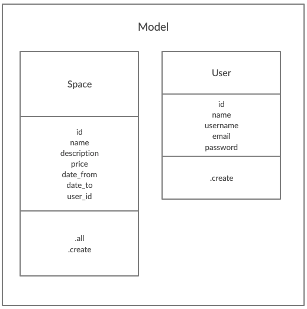
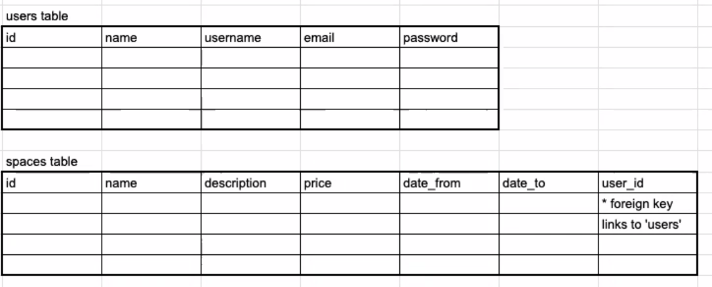

# **MakersBnb**

~ Presented by **self.code** ~

Soon to be completed. If beside yourself with impatience, please build it yourself and let us know, thanks!

# To install dependencies

```
$ bundle install
```

# To set up DataBase

## First setup (if user does not have PostgreSQL installed)

You should have [HomeBrew](https://brew.sh) installed

## Install PostgreSQL

```
$ brew install postgresql
```

After HomeBrew has finished downloading; follow on-screen installation instructions

```
$ brew services start postgresql
```

## Creating the database

```
$ psql postgres
postgres=# CREATE DATABASE makers_bnb;
postgres=# \c makers_bnb
```

Then run the queries saved in `./db/migrations/` in numerical order.

## Creating a test database (if required)

```
$ psql postgres
postgres=# CREATE DATABASE makers_bnb_test;
postgres=# \c makers_bnb
```

NB this is the same as the previous section with the exception of adding `_test`\
\
Then run the queries saved in `./db/migrations/` in numerical order.

# User stories

The following are the user stories the team generated from the project specification\

&nbsp;&nbsp;&nbsp;&nbsp;&nbsp;&nbsp;As a Host that has a space,\
&nbsp;&nbsp;&nbsp;&nbsp;&nbsp;&nbsp;So that I can advertise my space,\
&nbsp;&nbsp;&nbsp;&nbsp;&nbsp;&nbsp;I would like to be able to list my space.

&nbsp;&nbsp;&nbsp;&nbsp;&nbsp;&nbsp;As a User,\
&nbsp;&nbsp;&nbsp;&nbsp;&nbsp;&nbsp;So that I can see all of the properties,\
&nbsp;&nbsp;&nbsp;&nbsp;&nbsp;&nbsp;I want to be able to see a list of uploaded spaces.

&nbsp;&nbsp;&nbsp;&nbsp;&nbsp;&nbsp;As a User,\
&nbsp;&nbsp;&nbsp;&nbsp;&nbsp;&nbsp;So that I can use the website and it remembers me,\
&nbsp;&nbsp;&nbsp;&nbsp;&nbsp;&nbsp;I would like to be able to sign up my details to the website.

&nbsp;&nbsp;&nbsp;&nbsp;&nbsp;&nbsp;As a Host,\
&nbsp;&nbsp;&nbsp;&nbsp;&nbsp;&nbsp;So that I can list all of my properties,\
&nbsp;&nbsp;&nbsp;&nbsp;&nbsp;&nbsp;I want to be able to list multiple spaces on the website.

&nbsp;&nbsp;&nbsp;&nbsp;&nbsp;&nbsp;As a Host,\
&nbsp;&nbsp;&nbsp;&nbsp;&nbsp;&nbsp;So that I can advertise my space,\
&nbsp;&nbsp;&nbsp;&nbsp;&nbsp;&nbsp;I would like to be able to add a name and description to a space.

&nbsp;&nbsp;&nbsp;&nbsp;&nbsp;&nbsp;As a Host,\
&nbsp;&nbsp;&nbsp;&nbsp;&nbsp;&nbsp;So that I can make a profit,\
&nbsp;&nbsp;&nbsp;&nbsp;&nbsp;&nbsp;I would like to be able to add a list price to my space.

&nbsp;&nbsp;&nbsp;&nbsp;&nbsp;&nbsp;As a Guest,\
&nbsp;&nbsp;&nbsp;&nbsp;&nbsp;&nbsp;So that I can hire a space that I like,\
&nbsp;&nbsp;&nbsp;&nbsp;&nbsp;&nbsp;I would like to be able to request a reservation for 1 night.

&nbsp;&nbsp;&nbsp;&nbsp;&nbsp;&nbsp;As a technician,\
&nbsp;&nbsp;&nbsp;&nbsp;&nbsp;&nbsp;So that customers don’t double book,\
&nbsp;&nbsp;&nbsp;&nbsp;&nbsp;&nbsp;I would like to remove availability when a reservation is completed.

# To run tests

Run the tests from `./` using the command

```
$ rspec
```

# running the application

To run the application, run the following command in the root of the project and enjoy :) :

```
$ rackup
```

# Diagrams

The following diagrams are available in `./assets`

- Class diagram



- Table layout for databases



# Tools used during the project

## planning phase

- creately
- google docs
- google sheets
- trello
- slack
- zoom
- <span>notion.so</span>
- miro

# Team who collaborated on this project

## and their daily roles

| Name           | Day 1        | Day 2        | Day 3        | Day 4        | Day 5        |
| :------------- | :----------- | :----------- | :----------- | :----------- | :----------- |
| Nima Soufiani  | Leader       | Technician   | Helper       | Ideas        | Scribe       |
| Lila Walker    | Scrum master | Leader       | Technician   | Helper       | Ideas        |
| Liam Roberts   | Scribe       | Scrum master | Leader       | Technician   | Helper       |
| Daria Thompson | Ideas        | Scribe       | Scrum master | Leader       | Technician   |
| Anton Plisnier | Helper       | Ideas        | Scribe       | Scrum master | Leader       |
| John Baxter    | Technician   | Helper       | Ideas        | Scribe       | Scrum master |
